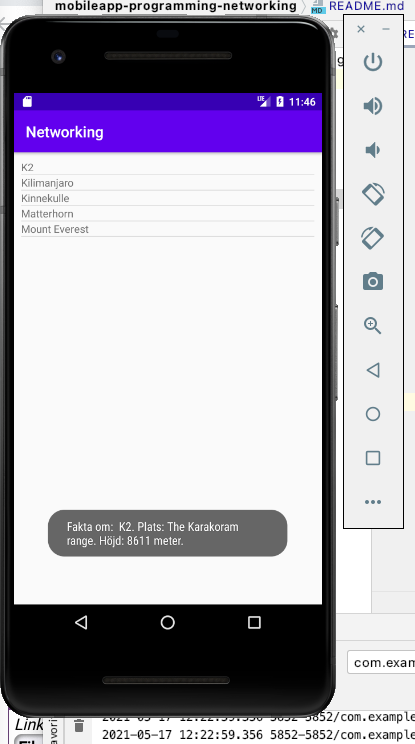

# Rapport Uppgift 6 - Networking

I layoutfilen lades det till en listview för att kunna presentera bergen som hämtades från webservicen 
i en lista. Den lades i en constraint layout och matchades i bredd och höjd. En margin lades på för att 
texten inte skulle vara precis i kanten. Den tilldelades ett id. Varje rad i listviewen är en textview
så därför skapas en ny resource sml-fil som döps till list_view_textview.
```
<ListView
        android:id="@+id/my_listview"
        android:layout_width="match_parent"
        android:layout_height="match_parent"
        android:layout_margin="10dp"
        ...
```

I MainActivity deklarerades två medlemsvariabler, ArrayList och ArrayAdapter. Adaptern behövs för att 
omkoppla så att items kan synas i vyn. 
```
private ArrayList<Mountain> arrayList;
    private ArrayAdapter adapter;
```

Koden för att kunna använda jasontask kopierades från ett exempel på duggasidan och lades i MainActivity
dock inte under onCreate, utan som en egen metod. För att kunna hämta data från websericen lades sedan 
nedan kod i onCreate.
```
new JsonTask().execute("https://wwwlab.iit.his.se/brom/kurser/mobilprog/dbservice/admin/getdataasjson.php?type=brom");
```

Efter att execute körs måste json-datan tolkas och en egen class skapas och döps till Mountain. I 
onPostEcecute meddelades adaptern att ändringar är gjorda och datan läses in och tolkas. Arraylistan
clearas för att bergen läggs till. 
```
@Override
        protected void onPostExecute(String json) {
            Log.d("AsyncTask ==>", json);
            Gson gson = new Gson();
            Mountain[] newMountains = gson.fromJson(json,Mountain[].class);
            arrayList.clear();
            for (int i = 0; i < newMountains.length; i++) {
                Mountain m = newMountains[i];
                Log.d("AsyncTask ==>", "Hittade ett berg: " + newMountains[i]);
                arrayList.add(m);
            }
            adapter.notifyDataSet
```

I Mountainklassen deklarerades en variabel för varje data som hämtades från webservicen. Därefter 
genererades getters för den datan som skulle visas i vyn. En Override skapas för att göra om 
datan till en String som ska synas i första vyn. Namnet på bergen returneras och blir det som syns.
```
public String getName() {
        return name;
    }

    public String getLocation() { return location; }

    public Integer getMeters() { return meters; }

    public Auxdata getAuxdata() {
        return auxdata;
    }

    @Override
    public String toString() { return name; }
}
```

För att få någon effekt när det klickas på något av bergen i listan så sätts en onClickItemListenter 
i onCreate i MainActivity. Viktigt att det är en onClickItemListener... och inte bara en onClikListener
för att specifikt kunna klicka på det berg som användaren vill veta mer om. 
En toast visar två fakta till om berget som det klickas på. Längden på toasten sattes till long för att användaren ska
hinna läsa faktan. 
```
listView.setOnItemClickListener(new AdapterView.OnItemClickListener() {
......(mer kod här)
                Log.d("MainActivity ==>", "Toast");
                Toast.makeText(MainActivity.this, "Fakta om:  " + temp_m.getName() + "." + " Plats: "
                        + temp_m.getLocation() + "." + " Höjd: " + temp_m.getMeters() + " meter.", Toast.LENGTH_LONG).show();
            }
        });
```
När toasten skapades uppstod det problem eftersom den inte syntes när det klickades på ett berg i vyn. 
Med handledningshjälp uppenbarades att en emulator med längre API var tvungen att laddas ner för att toasten
skulle fungera. 

Screenshot på hur appen ser ut när ett berg har klickats på och toasten visar sig.



